# Cloudflare Orange Build - Architecture Diagrams

This document contains comprehensive Mermaid diagrams representing the architecture of the Cloudflare Orange Build project.

## Presentation-Ready Architecture Diagram

*Copy-paste this beautiful diagram directly into your slides*

```mermaid
graph TB
    %% User Interface Layer
    subgraph "🖥️ Frontend (React + Vite)"
        UI["🎨 User Interface<br/>Dashboard & Chat"]
        Chat["💬 Real-time Chat<br/>WebSocket Connection"]
        Preview["👁️ Live Preview<br/>Sandbox Integration"]
    end
    
    %% API Gateway Layer
    subgraph "🚦 API Gateway Layer"
        APIRouter["🌐 API Router<br/>Hono Framework"]
    end
    
    %% Core Backend Services
    subgraph "🔐 Core Services (Cloudflare Workers)"
        Auth["🔑 Auth Service<br/>JWT + OAuth"]
        AgentController["🎛️ Agent Controller<br/>WebSocket Manager"]
        SandboxService["📦 Sandbox Service<br/>Container Orchestration"]
    end
    
    %% Agent System (Durable Objects)
    subgraph "🤖 Agent System (Durable Objects)"
        CodeGenAgent["⚡ Code Generator Agent<br/>Deterministic State Machine"]
        AgentState["💾 Agent State<br/>Persistent in Durable Object"]
    end
    
    %% AI Operations Pipeline
    subgraph "🧠 AI Operations Pipeline"
        BlueprintGen["📋 Blueprint Generation"]
        PhaseGen["📈 Phase Planning"]
        PhaseImpl["⚙️ Implementation"]
        CodeReview["🔍 Code Review"]
        CodeFixer["🛠️ Real-time Fixing"]
    end
    
    %% Storage & Infrastructure
    subgraph "☁️ Cloudflare Infrastructure"
        D1["🗄️ D1 Database<br/>User Data + Apps"]
        KV["🔗 KV Storage<br/>Sessions + Cache"]
        R2["📁 R2 Storage<br/>Templates + Assets"]
        Containers["🐳 Containers<br/>Sandbox Runtime"]
        AIGateway["🚪 AI Gateway<br/>Multi-Provider Router"]
    end
    
    %% External AI Providers
    subgraph "🤖 AI Providers"
        Gemini["💎 Gemini (Primary)"]
        OpenAI["🧠 OpenAI GPT-4"]
        Claude["🎭 Anthropic Claude"]
        Cerebras["🧪 Cerebras"]
    end
    
    %% External Services
    subgraph "🌍 External Services"
        GitHub["🐙 GitHub API"]
        OAuth["🔐 OAuth Providers"]
    end
    
    %% Request Flow
    UI --> APIRouter
    Chat --> APIRouter
    Preview --> APIRouter
    
    APIRouter --> Auth
    APIRouter --> AgentController  
    APIRouter --> SandboxService
    
    %% Agent Orchestration
    AgentController --> CodeGenAgent
    CodeGenAgent -.-> AgentState
    CodeGenAgent --> SandboxService
    
    %% AI Operations Flow
    CodeGenAgent --> BlueprintGen
    CodeGenAgent --> PhaseGen
    CodeGenAgent --> PhaseImpl
    CodeGenAgent --> CodeReview
    CodeGenAgent --> CodeFixer
    
    %% Data Persistence
    Auth --> D1
    AgentController --> KV
    SandboxService --> R2
    SandboxService --> Containers
    BlueprintGen --> R2
    
    %% AI Gateway Routing
    BlueprintGen --> AIGateway
    PhaseGen --> AIGateway
    PhaseImpl --> AIGateway
    CodeReview --> AIGateway
    CodeFixer --> AIGateway
    
    AIGateway --> Gemini
    AIGateway --> OpenAI
    AIGateway --> Claude
    AIGateway --> Cerebras
    
    %% External Integrations
    Auth --> OAuth
    SandboxService --> GitHub
    
    %% Styling
    classDef frontend fill:#e1f5fe,stroke:#01579b,stroke-width:2px,color:#000
    classDef router fill:#fff8e1,stroke:#f57f17,stroke-width:2px,color:#000
    classDef backend fill:#fff3e0,stroke:#e65100,stroke-width:2px,color:#000
    classDef agent fill:#ff9900,stroke:#cc7a00,stroke-width:3px,color:#fff
    classDef ai fill:#f3e5f5,stroke:#4a148c,stroke-width:2px,color:#000
    classDef infra fill:#e8f5e8,stroke:#1b5e20,stroke-width:2px,color:#000
    classDef aiproviders fill:#fce4ec,stroke:#880e4f,stroke-width:2px,color:#000
    classDef external fill:#f1f8e9,stroke:#33691e,stroke-width:2px,color:#000
    
    class UI,Chat,Preview frontend
    class APIRouter router
    class Auth,AgentController,SandboxService backend
    class CodeGenAgent,AgentState agent
    class BlueprintGen,PhaseGen,PhaseImpl,CodeReview,CodeFixer ai
    class D1,KV,R2,Containers,AIGateway infra
    class Gemini,OpenAI,Claude,Cerebras aiproviders
    class GitHub,OAuth external
```



---

## Detailed System Diagrams

### 1. Overall System Architecture


## 2. Hybrid Agent System Architecture


## 3. Authentication & User Management Flow


## 4. Sandbox System & Deployment Pipeline


## 5. Database Schema & Relationships

```mermaid
erDiagram
    users {
        text id PK
        text email UK
        text username UK
        text password_hash
        text full_name
        text avatar_url
        text verification_token
        integer email_verified
        timestamp created_at
        timestamp updated_at
    }
    
    sessions {
        text id PK
        text user_id FK
        text access_token
        text refresh_token
        timestamp expires_at
        timestamp created_at
    }
    
    teams {
        text id PK
        text name
        text slug UK
        text description
        text avatar_url
        text owner_id FK
        timestamp created_at
    }
    
    team_members {
        text team_id FK
        text user_id FK
        text role
        timestamp joined_at
    }
    
    apps {
        text id PK
        text title
        text description
        text slug
        text icon_url
        text original_prompt
        text final_prompt
        json blueprint
        text framework
        text user_id FK
        text team_id FK
        text session_token
        text visibility
        text board_id FK
        text status
        text deployment_url
        text cloudflare_account_id
        text deployment_status
        json deployment_metadata
        text github_repository_url
        text github_repository_visibility
        integer is_archived
        integer is_featured
        integer version
        text parent_app_id
        text screenshot_url
        timestamp screenshot_captured_at
        timestamp created_at
        timestamp updated_at
        timestamp last_deployed_at
    }
    
    cloudflare_accounts {
        text id PK
        text user_id FK
        text team_id FK
        text account_id
        text encrypted_api_token
        text account_name
        timestamp created_at
    }
    
    github_integrations {
        text id PK
        text user_id FK
        text team_id FK
        text github_username
        text encrypted_access_token
        json repositories
        timestamp created_at
    }
    
    boards {
        text id PK
        text name
        text description
        text slug UK
        text creator_id FK
        integer is_public
        timestamp created_at
    }
    
    users ||--o{ sessions : has
    users ||--o{ teams : owns
    users ||--o{ team_members : belongs_to
    teams ||--o{ team_members : has
    users ||--o{ apps : creates
    teams ||--o{ apps : owns
    users ||--o{ cloudflare_accounts : has
    teams ||--o{ cloudflare_accounts : has
    users ||--o{ github_integrations : has
    teams ||--o{ github_integrations : has
    users ||--o{ boards : creates
    boards ||--o{ apps : contains

## 6. User Journey Flow - App Creation to Deployment

```mermaid
journey
    title User Creates and Deploys an App
    section Getting Started
      Visit Homepage: 5: User
      Enter App Description: 4: User
      Start Generation: 5: User
    section Code Generation
      AI Creates Blueprint: 3: System
      Phase-wise Implementation: 4: System
      Real-time Code Review: 4: System
      Error Detection & Fixing: 3: System
    section Live Preview
      Sandbox Container Starts: 5: System
      Live Preview Available: 5: User
      Runtime Error Detection: 4: System
      Iterative Improvements: 4: User, System
    section Quality Assurance
      Static Analysis: 4: System
      Code Review Cycle: 3: System
      Auto-fix Critical Issues: 4: System
      User Feedback Integration: 5: User
    section Deployment
      Resource Provisioning: 3: System
      Template Parsing: 3: System
      Cloudflare Workers Deploy: 5: System
      Live App URL Generated: 5: User
    section Post-Deployment
      Save to Dashboard: 4: User
      Share with Community: 3: User
      GitHub Export: 4: User
```

## 7. Real-time Communication Flow


## 8. AI Operations Pipeline

```mermaid
flowchart TD
    %% User Input
    Input["🗣️ User Prompt<br/>Natural Language Request"]
    
    %% Planning Phase
    subgraph "📋 Planning Phase"
        TemplateSelection["🏷️ Template Selection<br/>Cloudflare Stack Templates"]
        BlueprintGen["🏠 Blueprint Generation<br/>PRD + Architecture Design"]
    end
    
    %% State Machine Controller
    subgraph "🤖 Deterministic State Machine"
        StateMachine["⚙️ Agent State Controller<br/>generateAllFiles()"]
        
        subgraph "🔄 State Transitions"
            PhaseGenerating["📈 PHASE_GENERATING"]
            PhaseImplementing["🚀 PHASE_IMPLEMENTING"]
            Reviewing["🔍 REVIEWING"]
            Finalizing["✨ FINALIZING"]
            Idle["✅ IDLE"]
        end
    end
    
    %% Operations Layer
    subgraph "🧠 AI Operations"
        PhaseGenOp["📈 Phase Generation<br/>Development Phases"]
        PhaseImplOp["🚀 Phase Implementation<br/>File Generation + SCOF"]
        CodeReviewOp["🔍 Code Review<br/>Issue Detection"]
        FastCodeFixerOp["⚡ Fast Code Fixer<br/>Quick Issue Fixes"]
        FileRegenOp["🛠️ File Regeneration<br/>Surgical Code Repairs"]
        ScreenshotAnalysisOp["📷 Screenshot Analysis<br/>Visual Validation"]
        UserConvOp["💬 User Conversation<br/>Feedback Processing"]
    end
    
    %% Quality Assurance
    subgraph "🔍 Quality Assurance"
        ReviewCycles["🔄 Review Cycles<br/>Up to 5 iterations"]
        IssueCheck{{"⚠️ Issues Found?"}}
        StaticAnalysis["📊 Static Analysis<br/>Code Validation"]
    end
    
    %% External Integration
    subgraph "🤖 AI Gateway"
        AIGateway["🚪 Cloudflare AI Gateway<br/>Multi-Provider Router"]
        
        subgraph "🌐 AI Providers"
            Gemini["💎 Gemini (Primary)"]
            GPT["🧠 GPT-4"]
            Claude["🎭 Claude"]
            Cerebras["🧪 Cerebras"]
        end
    end
    
    %% Main Flow
    Input --> TemplateSelection
    TemplateSelection --> BlueprintGen
    BlueprintGen --> StateMachine
    
    %% State Machine Flow
    StateMachine --> PhaseGenerating
    PhaseGenerating --> PhaseImplementing
    PhaseImplementing --> Reviewing
    Reviewing --> Finalizing
    Finalizing --> Idle
    
    %% Operations Execution
    PhaseGenerating --> PhaseGenOp
    PhaseImplementing --> PhaseImplOp
    Reviewing --> CodeReviewOp
    
    %% Quality Control Loop
    CodeReviewOp --> ReviewCycles
    ReviewCycles --> IssueCheck
    IssueCheck -->|"✅ Yes"| FastCodeFixerOp
    IssueCheck -->|"✅ Yes"| FileRegenOp
    IssueCheck -->|"❌ No"| StaticAnalysis
    FastCodeFixerOp --> PhaseImplementing
    FileRegenOp --> PhaseImplementing
    
    %% User Interaction
    UserConvOp --> PhaseGenerating
    ScreenshotAnalysisOp --> CodeReviewOp
    
    %% AI Integration
    TemplateSelection --> AIGateway
    BlueprintGen --> AIGateway
    PhaseGenOp --> AIGateway
    PhaseImplOp --> AIGateway
    CodeReviewOp --> AIGateway
    FastCodeFixerOp --> AIGateway
    FileRegenOp --> AIGateway
    ScreenshotAnalysisOp --> AIGateway
    UserConvOp --> AIGateway
    
    AIGateway --> Gemini
    AIGateway --> GPT
    AIGateway --> Claude
    AIGateway --> Cerebras
    
    %% Enhanced Styling
    classDef planning fill:#e3f2fd,stroke:#1976d2,stroke-width:2px,color:#000
    classDef statemachine fill:#fff3e0,stroke:#f57c00,stroke-width:3px,color:#000
    classDef states fill:#f3e5f5,stroke:#7b1fa2,stroke-width:2px,color:#000
    classDef operations fill:#e8f5e8,stroke:#388e3c,stroke-width:2px,color:#000
    classDef quality fill:#ffebee,stroke:#d32f2f,stroke-width:2px,color:#000
    classDef ai fill:#ff9900,stroke:#cc7a00,stroke-width:3px,color:#fff
    classDef decision fill:#fff8e1,stroke:#f57f17,stroke-width:2px,color:#000
    classDef success fill:#66ff66,stroke:#2e7d32,stroke-width:3px,color:#000
    classDef providers fill:#fce4ec,stroke:#c2185b,stroke-width:2px,color:#000
    
    class Input,TemplateSelection,BlueprintGen planning
    class StateMachine statemachine
    class PhaseGenerating,PhaseImplementing,Reviewing,Finalizing states
    class Idle success
    class PhaseGenOp,PhaseImplOp,CodeReviewOp,FastCodeFixerOp,FileRegenOp,ScreenshotAnalysisOp,UserConvOp operations
    class ReviewCycles,StaticAnalysis quality
    class IssueCheck decision
    class AIGateway ai
    class Gemini,GPT,Claude,Cerebras providers
```



## 9. Technology Stack Overview


